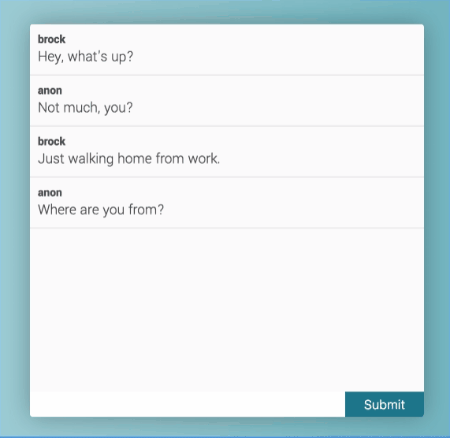

#routing.js Example

The example in `./index.html` is a controller with a single **home** view. The JavaScript for **home** is located in `js/controllers/home.js` and the HTML is located in `pages/home.html`. The **home** view has a `b-repeat` action that creates a new `.ind-message` inside of `.message-container` every time that the button with the `b-click="submit"` is run with the contents of `b-name="input"`.

Onclick of any `.ind-message` it gets removed using the `$scope.repeat(name).remove` function that is passed either the node from the repeat to be deleted or the ID of it.
